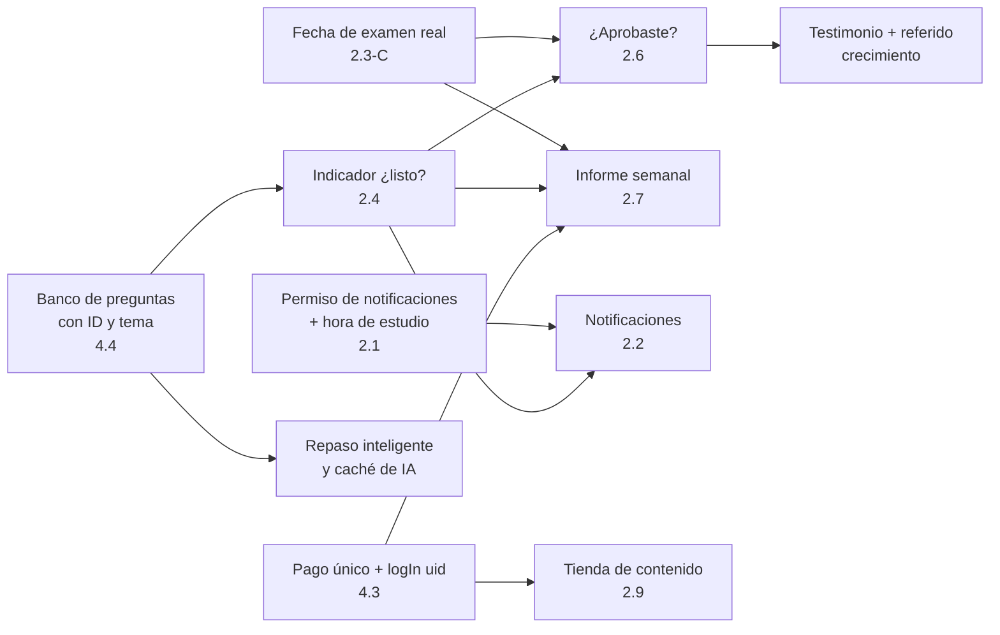

# Bali AI — Plan de cambios y paso a pago único

> **Fecha:** 2026-10-01 · **Rama:** `ccr-d069eb87-gq5uz1` · **Estado:** propuesta, nada de esto está implementado todavía.
>
> Este documento recoge (1) los cambios de producto que has pedido, (2) elementos de gamificación
> basados en el blog de RevenueCat, (3) el cambio de modelo de negocio a **pago único (~30 €)** y lo que
> hay que hacer para que sea rentable, y (4) funcionalidades extra que se deducen de esas lecturas.
> Cada punto parte de lo que **hay hoy en el código**, no de suposiciones.
>
> **Decisión (2026-10-02):** se **mantiene la suscripción mensual y se sube el precio**; el pago único queda como
> alternativa descartada por ahora. Lee primero la sección **4.0**: contiene un hallazgo que condiciona el plan
> (hoy la app **no retira el acceso** cuando caduca la suscripción). Las secciones 4.1 en adelante analizan el
> pago único y se conservan como referencia.

## Índice

0. [Resumen ejecutivo](#0-resumen-ejecutivo)
1. [Punto de partida: lo que he encontrado en el código](#1-punto-de-partida-lo-que-he-encontrado-en-el-código)
2. [Cambios solicitados](#2-cambios-solicitados)
   [2.1 Hora de estudio](#21-hora-de-estudio) ·
   [2.2 Notificaciones](#22-notificaciones) ·
   [2.3 Onboarding sin fricción](#23-onboarding-sin-fricción) ·
   [2.4 Indicador «¿estás listo?»](#24-indicador-estás-listo) ·
   [2.5 Conseguir feedback](#25-conseguir-feedback) ·
   [2.6 «¿Aprobaste?»](#26-aprobaste) ·
   [2.7 Informe semanal por email](#27-informe-semanal-por-email) ·
   [2.8 Sonidos](#28-sonidos) ·
   [2.9 Tienda con dinero real](#29-tienda-con-dinero-real)
3. [Gamificación](#3-gamificación)
4. [Modelo de negocio: pago único](#4-modelo-de-negocio-pago-único)
5. [Funcionalidades adicionales](#5-funcionalidades-adicionales)
6. [Orden de ejecución y dependencias](#6-orden-de-ejecución-y-dependencias)
7. [Impacto técnico transversal](#7-impacto-técnico-transversal)
8. [Riesgos y decisiones abiertas](#8-riesgos-y-decisiones-abiertas)
9. [Sincronización con BaliAIPage (landing)](#9-sincronización-con-baliaipage-landing)
10. [Fuentes y límites de la investigación](#10-fuentes-y-límites-de-la-investigación)

Esfuerzo orientativo para una persona: **S** ≤ 1 semana · **M** 1–3 semanas · **L** > 3 semanas.

---

## 0. Resumen ejecutivo

**La idea central.** Con pago único, el ingreso de cada usuario se cobra *una vez, en el paywall*. Ya no
hay renovaciones que compensen un mal mes. La fórmula pasa a ser:

```
ingresos netos = instalaciones × conversión a compra × precio neto − reembolsos − coste de IA
```

Y el motor de crecimiento deja de ser la retención y pasa a ser **aprobar el examen → testimonio →
referido**. Por eso «¿Aprobaste?» (2.6) deja de ser un extra y pasa a ser la pieza más importante del plan.

**Cinco cosas que condicionan todo lo demás**

| # | Hallazgo | Por qué importa |
|---|----------|-----------------|
| 1 | La fecha de examen que guarda el onboarding es una **estimación** (hoy + 2, 10 o 21 días según el botón pulsado), no una fecha real. | «¿Aprobaste?» y el informe semanal dependen de ella. Hay que capturar la fecha real. |
| 2 | No hay **ninguna petición del permiso de notificaciones** en el código (Android 13+). | Sin opt-in no llega ninguna notificación; todo el bloque 2.1–2.2 depende de arreglarlo. |
| 3 | `Answer` solo guarda el texto de la pregunta: **sin ID de pregunta ni tema**. | Sin eso no se puede calcular «¿estás listo?», ni repasar fallos, ni cachear explicaciones de IA. |
| 4 | `HomeUiState.readinessPercent` existe pero **nunca se calcula** (vale 5 por defecto). | El hueco de UI ya está; falta el algoritmo. |
| 5 | La **IA es el único coste variable** y hoy cada test/simulacro genera preguntas con Gemini. | Con pago único, un usuario intensivo puede salir a pérdidas. Hay que acotarlo antes de cambiar el precio. |

**Sobre el pago único.** RevenueCat desaconseja los planes *lifetime* en educación, pero su razón es que
infra-monetizan a los suscriptores fieles a largo plazo. Eso no describe a Bali: el objetivo del usuario
es sacarse el carné en semanas y después se va. El riesgo que **sí** aplica es regalar uso ilimitado de IA y no
vender nada más. La respuesta es: precio bien elegido (test A/B), IA acotada, y *add-ons* (sección 4).

---

## 1. Punto de partida: lo que he encontrado en el código

### 1.1 Numeración del onboarding (`o10`–`o15` y «la 011»)

El nombre de cada evento de embudo se deriva de la posición en `stepsOrder`
(`OnboardingViewModel.kt`), así que la numeración actual es esta:

| Pos. | Slug | Tipo | | Pos. | Slug | Tipo |
|------|------|------|-|------|------|------|
| o01 | `motivation` | pregunta | | o14 | `gain_experiences` | informativa |
| o02 | `reasons` | pregunta | | o15 | `gain_level_up` | informativa |
| o03 | `concern` | pregunta | | o16 | `name` | pregunta |
| o04 | `experience` | pregunta | | **o17** | **`exam_date`** | pregunta |
| o05 | `comparison` | informativa | | o18 | `province` | pregunta |
| o06 | `readiness` | pregunta | | o19 | `province_confirmed` | informativa |
| o07 | `future_impact` | pregunta | | o20 | `weekly_study` | pregunta |
| o08 | `empathy` | informativa | | o21 | `learning_preference` | pregunta |
| o09 | `loss_time` | informativa | | o22 | `social_proof` | informativa |
| **o10** | `loss_opportunity` | informativa | | o23 | `processing` | animación |
| **o11** | `loss_autonomy` | informativa | | o24 | `plan_reveal` | informativa |
| **o12** | `method_comparison` | informativa | | o25 | `pact` | pregunta |
| **o13** | `gain_freedom` | informativa | | | | |

- **o10–o15 son seis pantallas informativas seguidas** (dolor → método → deseo). Encaja con tu intuición de
  que ahí hay fricción.
- **La fecha de examen se pregunta en `o17_exam_date`, no en o11.** Interpreto «la 011» como *la pantalla que
  guarda la fecha de examen*. Si te referías a otra cosa, avísame y ajusto las dependencias de 2.6 y 2.7.

### 1.2 La fecha de examen es una estimación

`OnboardingConfig.examDateFor()` convierte el botón pulsado en una fecha aproximada
(`< 3 días → +2 d`, `esta semana o la siguiente → +10 d`, `> 2 semanas → +21 d`,
`aún no lo he reservado → null`) y esa es la que se guarda en `User.examDateMillis`.
Para planificar una ruta vale; para preguntar «¿aprobaste?» o contar los días que faltan en un email, **no**.

### 1.3 Otros hechos relevantes

| Área | Estado actual |
|------|---------------|
| Notificaciones | OneSignal + FCM. Solo hay un canal (`Bali AI`, `IMPORTANCE_HIGH`). `onMessageReceived` está vacío. **Nadie pide `POST_NOTIFICATIONS`.** `OneSignal.login(uid)` se hace tras iniciar sesión, pero no se envían *tags* ni eventos. |
| Hora de estudio | No existe en esta rama. **Existió y se eliminó** en el commit `164b384` (2026-08-02, refactor del «arco emocional»), junto con `OneSignal.Notifications.requestPermission(false)`. `User.kt` documenta que «study time» no se persiste a propósito. PostHog muestra además una **build 1.2.2** (1 usuario, 30-sep) que emite `o21_study_time`, `o22_notifications`, `exam_date_set` y `notifications_permission_result`: no está en esta rama (¿trabajo local?). Hay que reconciliarla antes de implementar 2.1 para no duplicar. |
| Racha | El servidor (Cloud Function **que no está en este repo**) calcula `currentStreak`. En cliente solo se registran `practiceDays` y `weekSessions`. `StreakStatus.FROZEN` nunca se produce. |
| Gamificación existente | XP, niveles, monedas (8–10 por sesión), congeladores de racha (120 monedas, máx. 2), 5 minijuegos, tienda solo de monedas. Ya existe `confetti.json` (Lottie). |
| Monetización | RevenueCat 10.16.0, entitlement `premium`, **hard paywall** tras el onboarding, oferta *win-back* mensual con descuento (`winback_monthly_discount`). `Purchases.configure(appUserID = null)` → ID anónimo; **no hay `Purchases.logIn(uid)`**. El flujo es `PAYWALL → LOGIN`, es decir, se paga antes de tener cuenta. |
| IA | `gemini-3.1-flash-lite` vía Firebase AI Logic + App Check. `AnalyticsTracker.testGenerated/examGenerated` ya reporta tokens por llamada. Hay un banco estático (`LessonQuestionBank`) para la ruta, pero práctica y simulacros se generan con IA. |
| Prueba social | `OnboardingConfig`/`StepComparison` tienen **hardcodeados** «1.000 usuarios», «4,8/5 en Google Play», un 89 % de aprobados y cinco testimonios con nombre. Ver riesgo en la sección 8. |
| Esquema de datos | Room v13, migraciones Firestore hasta `MigrationV5ToV6`. `CLAUDE.md` obliga a Room *migration* + Firestore *migration* para cualquier campo nuevo. |
| Decisiones abiertas en `CLAUDE.md` | Este plan toca tres: *práctica libre inalcanzable* (2.4/5), *sin gestión de suscripción* (4.3) y *congelación de racha sin feedback visual* (3). |

---

## 2. Cambios solicitados

### 2.1 Hora de estudio

**Qué.** El onboarding pregunta a qué hora estudias — **9, 14, 18 o 21 h** — y el recordatorio llega a esa hora.

**Cambios**
- Nuevo paso `study_hour` en `OnboardingStep` (+ `OnboardingEvent.SelectStudyHour`, reducer y
  `OnboardingConfig.studyHours = listOf(9, 14, 18, 21)`). Va justo después de `weekly_study`: «¿Con qué frecuencia?»
  y «¿a qué hora?» se responden seguidas.
- **El permiso de notificaciones se pide aquí**, con contexto: tras elegir hora, texto «Te avisaremos a las
  18:00. Sin spam» y a continuación `OneSignal.Notifications.requestPermission(...)`. Pedirlo en frío al abrir
  la app convierte mucho peor; pedirlo justo después de que el usuario haya elegido la hora, mejor.
- `User.studyHour: Int?` en dominio, Room, Firestore y mappers. **Room 13 → 14** y
  **`MigrationV6ToV7`** (Firestore) registrada con `@IntoSet`, como exige `CLAUDE.md`.
- Ajustes: fila «Hora de estudio» para cambiarla, y toggle por tipo de notificación (ver 2.2).
- Etiquetar en OneSignal: `study_hour`, para segmentar en el dashboard.

**Si el usuario rechaza el permiso**: guardar la hora igualmente y mostrar en Home un aviso discreto
«Activa las notificaciones para que te avisemos a las 18:00» (máx. 1 vez por semana).

**Medimos:** `study_hour_selected` (con valor), `notif_permission_prompted/granted/denied`.
**Esfuerzo:** S.

---

### 2.2 Notificaciones

**Qué.** Cuatro tipos: recordatorio diario, aviso de racha en peligro, rescate a las 48 h en la primera
semana, y mensaje si llevas 3–5 días sin abrir la app.

**Escalera de mensajes** (el principio es que *un usuario nunca recibe dos avisos el mismo día salvo la racha*):

| # | Notificación | Disparador | Hora | Borrador de copy | Se cancela si |
|---|--------------|-----------|------|------------------|---------------|
| 1 | **Recordatorio diario** | Hora de estudio elegida; solo si hoy **no** ha practicado | 9 / 14 / 18 / 21 h locales | «Son las 18:00, tu hora de estudio. Con 10 minutos sumas otro día a tu racha.» | Ya practicó hoy · aprobó el examen · lleva 2 recordatorios seguidos sin abrir |
| 2 | **Racha en peligro** | Racha ≥ 3 días, sin práctica hoy, y el recordatorio 1 ya pasó | Hora de estudio + 2 h, **máx. 22:30** | «Tu racha de 5 días se pierde esta noche. Un test de 5 minutos la salva.» (Si tiene congelador: «Tienes 1 congelador: se usará solo. ¿Prefieres practicar?») | Practica · se consume congelador |
| 3 | **Rescate a las 48 h** (1.ª semana) | 48 h tras terminar onboarding/compra sin primera lección, o 48 h sin abrir dentro de los 7 primeros días | Hora de estudio | «Tu plan de {n} semanas te espera. Tu primera lección son 3 minutos.» | Abre la app y practica |
| 4 | **Inactividad 3–5 días** | 3 y 5 días sin abrir (una sola vez cada uno) | Hora de estudio | Con fecha: «Faltan {d} días para tu examen y llevas 3 sin practicar. 10 minutos hoy.» · Sin fecha: «¿Ya sabes cuándo es tu examen? Díselo a Bali y ajustamos el plan.» | Abre la app |

**Después del día 5: silencio.** Más avisos aumentan las desinstalaciones y los *opt-out*; a partir de ahí
solo el email semanal (2.7).

**Quién envía cada cosa — recomendación**

- **1 y 2 → notificaciones locales con WorkManager.** Dependen del estado en el instante de enviar («¿ya practicó
  hoy?»), y `practiceDays` está en Room. Funcionan sin red y sin coste de servidor. Un `OneTimeWorkRequest` se
  rearma en cada apertura para la siguiente hora de estudio (inexacto, ±15 min; no hace falta
  `SCHEDULE_EXACT_ALARM`).
- **3 y 4 → OneSignal Journeys.** Son mensajes de ciclo de vida: se benefician de A/B de copy y de métricas sin
  publicar versión nueva. Requieren que la app envíe eventos/tags (`onboarding_completed`, `practice_completed`,
  `last_practice_day`, `streak`, `exam_days_left`, `study_hour`).
- La regla de exclusión es sencilla: la escalera 1→2→(2 días)→3/4 no se solapa por construcción.

**Cambios técnicos**
- Separar el canal único en tres: `recordatorios` (importancia por defecto, **no** HIGH), `racha` (alta) y
  `novedades` (baja). Así el usuario puede silenciar uno sin apagar todo.
- `ReminderScheduler` + `ReminderWorker` (`hilt-work`), y `NotificationPrefs` en DataStore.
- Pantalla de ajustes con un toggle por tipo y «No molestar de 22:30 a 08:00».
- Tag/evento a OneSignal desde `AnalyticsTracker` (regla de `CLAUDE.md`: nunca llamar al SDK desde un ViewModel).
- Privacidad: se envían datos de uso a OneSignal → actualizar política y formulario *Data safety* (sección 7).

**Dependencias:** 2.1 (hora + permiso). El mensaje 4 sin fecha se apoya en el banner «Pon tu fecha» de 2.3.
**Medimos:** opt-in, CTR por tipo, retención D7 con/sin recordatorio, *opt-out* y desinstalaciones tras cada envío.
**Esfuerzo:** M (cliente) + M (Journeys y eventos).

---

### 2.3 Onboarding sin fricción

**Qué.** Juntar `o10`–`o15` en 2 pantallas y dar un mensaje propio al **64 %** que aún no tiene fecha de examen.

#### A) Seis pantallas informativas → 2

Propuesta que conserva el arco dolor → deseo → método:

| Nueva pantalla | Sustituye a | Contenido |
|----------------|-------------|-----------|
| **`before_after`** («Sin carné / Con carné») | `loss_opportunity`, `loss_autonomy`, `gain_freedom`, `gain_experiences`, `gain_level_up` | Una sola pantalla con dos bloques: *«Hoy te cuesta…»* (trabajo, autonomía) y *«Con el carné…»* (libertad, escapadas, siguiente paso), cada uno con su Lottie existente (`door_open`, `bus`, `freedom`, `experiences`, `level_up`). |
| **`method_comparison`** | (sin cambios) | La comparativa del método pasa a ser el cierre del arco: «Así lo conseguimos». |

Resultado: 25 − 6 + 2 = **21 pantallas**, y **22** al añadir `study_hour` (2.1).
Opcionalmente, `loss_time` (o09) puede absorberse también en `before_after`.

| Antes | Después |
|-------|---------|
| 25 pantallas | **22** (−6 informativas, +2 fusionadas, +1 `study_hour`) |
| `exam_date` = o17 | `exam_date` = o13 |

> ⚠️ **No lo despliegues a ciegas.** La documentación de RevenueCat y Superwall que usa este repo
> (`.claude/skills/mobile-onboarding`) señala que, en categorías de alta implicación, los onboardings **más
> largos suelen subir la conversión**, aunque las pantallas extra no recojan datos. Tu hipótesis (fricción) es
> razonable, pero hay que **medirla**: publicar ambas variantes con un *flag* de Remote Config
> (`onboarding_condensed`) y comparar **conversión a compra**, no solo «completan el onboarding».

**Efectos colaterales a tener en cuenta**
- Los nombres `oNN_slug` se derivan de la posición → al reordenar, **el embudo de PostHog/Firebase se
  renumera**. Comparar siempre por *slug* o añadir `step_slug` como propiedad.
- `OnboardingViewModelTest` fija el orden de eventos; hay que actualizarlo.

#### B) Mensaje propio para quien no tiene fecha (64 %)

Hoy «🤷 Aún no lo he reservado» solo pone `examDate = null` y sigue de largo. Cambio:

- Al pulsarla, en vez de avanzar, aparece **una tarjeta inline** (no una pantalla nueva):

  > **Sin fecha, sin problema.** Te preparo un plan de 4 semanas y, cuando reserves tu examen, lo ajusto al día.
  > Además te aviso en cuanto tu probabilidad de aprobar pase del 85 %, que es buen momento para reservarlo.
  > **[ Continuar ]**  ·  *Avísame en 7 días para poner mi fecha*

- Se guarda `examTiming = UNBOOKED`. El plan **ya tiene respaldo sin fecha** (`planTargetDate` en `StepPlanReveal`
  calcula las semanas según `weeklyStudy` y `StepProcessing` muestra «Repartiendo por semanas»), así que no
  hay que tocar la lógica del plan: falta el mensaje propio y el seguimiento posterior.
- **Después del onboarding**, para este segmento: banner en Home «¿Ya tienes fecha?» con selector de calendario,
  el mensaje 4 de 2.2 (variante «sin fecha») y una notificación cuando el indicador de 2.4 pase del 85 %.
- Pasar de «sin fecha» a «con fecha» es **el evento más valioso del segmento**: medirlo (`exam_date_set`).

> Verifica el 64 % en PostHog (la respuesta `examTiming` ya se registra) y comprueba si coincide con
> quienes luego compran. Si el segmento «sin fecha» convierte peor, esta pantalla debe estar pensada
> para *calentarlos*, no solo para tranquilizarlos.

#### C) Capturar la fecha real (necesario para 2.6 y 2.7)

El botón de bucket sigue siendo la forma menos fricción de entrar. Pero hay que **confirmar la fecha real**
dentro de la primera semana:
- `User.examDateConfirmed: Boolean` (o `examDateSource`: `ESTIMATED | CONFIRMED`).
- Tarjeta en Home «Confirma el día de tu examen» con `DatePicker` de Material3 + notificación de 2.2.
- Hasta que no esté confirmada, «¿Aprobaste?» usa solo un aviso blando («¿Ya hiciste tu examen?»).

**Medimos:** completitud del onboarding, conversión a compra por variante, % de `exam_date` confirmadas a 7 días.
**Esfuerzo:** M (con test A/B).

---

### 2.4 Indicador «¿estás listo?»

**Qué.** Un algoritmo que estime si el usuario aprobaría hoy.

**Regla del examen.** 30 preguntas, máximo 3 fallos. Hoy `ExamViewModel` lo fija como literal
(`correct >= 27`); extraerlo a una constante compartida con el algoritmo para que nunca diverjan.

**Prerrequisito (bloqueante).** `Answer` debe tener `questionId`, `topic` y `mode`. Sin IDs estables no hay
dificultad por pregunta, ni repaso espaciado, ni caché de explicaciones. Esto empuja a tener un **banco de
preguntas con ID** (ver 4.4), lo que además reduce el coste de IA.

**Algoritmo propuesto (explicable, sin ML en la v1)**

1. **Dominio por tema** `p_t`, con suavizado bayesiano y peso por recencia (vida media ≈ 7 días):
   `p_t = (Σ wᵢ·aciertoᵢ + α) / (Σ wᵢ + α + β)`, con *prior* distinto para primera vez / repetidor.
2. **Simulación de examen:** Monte Carlo de 10 000 exámenes de 30 preguntas, muestreando temas según el peso
   real del examen y acertando cada pregunta con probabilidad `p_t`. La salida es **P(fallos ≤ 3)**.
3. **Confianza:** si hay pocos datos (p. ej. < 150 respuestas o < 3 simulacros completos) **no se muestra un
   porcentaje**: «Aún no tengo datos suficientes. Te faltan 80 preguntas». Decir «estás listo» y que el usuario
   suspenda es lo peor que puede pasar con el pago único (reembolsos + reseñas).
4. **Semáforo**:

| Probabilidad | Mensaje | Acción sugerida |
|--------------|---------|-----------------|
| ≥ 90 % | «Listo para el examen» | Reserva fecha (si no la tiene) · simulacro de confirmación |
| 70–90 % | «Casi» | Los 2 temas más débiles |
| < 70 % | «Aún no» | Plan de refuerzo + fecha estimada de «estar listo» |

5. **Calibración con datos reales:** «¿Aprobaste?» (2.6) devuelve el resultado real. Guardar un *snapshot* del
   indicador el día del examen y medir **Brier score**/curva de calibración. Con ~500 resultados etiquetados se
   puede pasar a regresión logística; antes, no.

**Dónde vive:** `domain/usecase/CalculateReadinessUseCase` (puro Kotlin, sin Android) + `ReadinessResult`; se
ejecuta en local sobre Room (funciona offline). Se rellena `HomeUiState.readinessPercent` (hoy huérfano), se
muestra en el resultado de cada test y alimenta notificaciones (2.2) y el email (2.7).
La tarjeta «Refuerza Señales» sirve además como **nueva entrada a la práctica libre por tema**, lo que cierra
la decisión abierta *«Free practice is unreachable»* de `CLAUDE.md`.

**Tests:** `FakeUserRepository`/`FakeAnswerRepository` con casos límite (0 datos, 100 % aciertos, un tema
hundido, datos antiguos que caducan).
**Medimos:** `readiness_viewed`, calibración (predicción vs. resultado real), uso del botón de refuerzo.
**Esfuerzo:** L (M de datos previos + M del algoritmo y UI).

---

### 2.5 Conseguir feedback

**Qué.** Incentivar que el usuario dé feedback de la app.

**Dos canales distintos — no mezclarlos**

| | Feedback **privado** (encuesta in-app) | Reseña **pública** (Google Play) |
|-|----------------------------------------|----------------------------------|
| Incentivo | **Sí**: +30 monedas (máx. 1 cada 14 días) | **No. Nunca.** Google prohíbe incentivar valoraciones |
| Cuándo | Tras el primer simulacro · racha de 7 · al aprobar | Tras un buen resultado (ya existe el *prompt* de reseña) |
| Qué | NPS 0–10 + «¿qué mejorarías?» (texto libre) | `In-App Review API` |

> Revisa las guías vigentes de la *In-App Review API* antes de implementarlo: Google pide no condicionar el
> aviso de reseña a una pregunta previa de satisfacción («review gating»). Mantén **encuesta privada** y
> **reseña pública** como flujos independientes.

**Cambios**
- **No se parte de cero:** ya hay un buzón (`SuggestionsRoute` → `SuggestionsScreen`, modelo
  `Suggestion(text, userId, email, timestamp)`). Se amplía con `type` (`sugerencia|nps|reporte`), `nps: Int?`,
  `appVersion` y `readiness`, en lugar de crear una colección paralela. Eso implica una `FirestoreMigration`
  si cambia la estructura de documentos existentes (regla de `CLAUDE.md`).
- `FeedbackViewModel` con `UiState` único; tarjeta de feedback en Home y acceso desde Ajustes (ya existe la ruta).
- **«Reportar pregunta»** (👎) en cada pregunta y explicación de la IA: es feedback *y* control de calidad
  de contenido generado. Recompensa pequeña (+5 monedas) solo cuando el reporte se confirma.
- Evento `feedback_submitted`, `question_reported` en `AnalyticsTracker`.

**Medimos:** tasa de respuesta, NPS por cohorte, nº de preguntas reportadas y confirmadas.
**Esfuerzo:** S.

---

### 2.6 «¿Aprobaste?»

**Qué.** Pasada la fecha de examen, preguntar cómo fue. Si aprobó → celebración, invitar a un amigo y pedir
testimonio. Si no → plan nuevo. **Depende de la fecha que guarda `exam_date`** (ver 1.2 y 2.3-C).

**Disparo**
- `examDateConfirmed = true` → notificación a las 20:00 del día del examen («¿Cómo te ha ido hoy?») y tarjeta al abrir la app.
- Fecha solo estimada → +3 días y tono blando («¿Ya hiciste tu examen?»).
- Opciones: **Aprobé · Suspendí · Aún no lo he hecho / lo cambié** (esta última abre el selector de fecha).

**Si aprobó** (flujo corto, una pantalla cada paso, saltable)
1. Celebración con `confetti.json`, insignia «Teórico aprobado» y monedas.
2. **Testimonio**: una frase + nombre de pila. Casilla de **consentimiento explícito** para publicarlo
   (RGPD). Se guarda con `testimonialConsentAt`.
3. **Invitar a un amigo**: enlace de referido (recompensas en 4.5).
4. **Reseña en Play** (sin incentivo).
5. Dato interno: «¿Cuántos días estudiaste? ¿Qué te ayudó más?».
6. `examOutcome = PASSED` → se detienen notificaciones y se **acota el uso de IA** (el coste ya no genera valor).

**Si suspendió**
1. Mensaje empático, sin confeti. Pregunta rápida: nº de fallos y temas donde falló.
2. **Plan de rescate** nuevo con `GenerateInitialPathUseCase` ponderando esos temas + nueva fecha.
3. Como el acceso es de pago único, **no se vuelve a cobrar**: ese es un argumento de confianza y debe
   aparecer también en el paywall («si suspendes, sigues teniendo acceso»).
4. Si más adelante hay garantía (4.7), este flujo es el que la tramita.
5. Se reanudan las notificaciones.

**Datos nuevos** (Room 14 / `MigrationV6ToV7`): `examOutcome` (`PASSED|FAILED|null`), `examOutcomeAtMillis`,
`examErrors: Int?`, `attempts: Int`.

**Por qué es la pieza clave:** produce (a) el testimonio y los referidos que sustituyen al presupuesto de
adquisición, (b) la etiqueta real para calibrar 2.4, y (c) una **tasa de aprobados verificable** para
reemplazar el 89 % hardcodeado en `StepComparison`.

**Medimos:** % que responde, % aprobados, % que deja testimonio, % que comparte referido.
**Esfuerzo:** M.

---

### 2.7 Informe semanal por email

**Qué.** Cada 7 días **desde la compra**: aciertos, ritmo frente al plan, días que faltan, y en qué centrarse la
semana siguiente. **Depende de la fecha de examen y de OneSignal.**

**Contenido del email**
- Aciertos de la semana (% y variación vs. la anterior) y nº de preguntas.
- Ritmo vs. plan: sesiones hechas / `weeklyGoal` (`weekSessions` ya existe).
- Días para el examen (`examDateMillis`); si no hay fecha: «Pon tu fecha» con enlace.
- **Foco de la semana**: el tema con menor `p_t` del algoritmo 2.4, con enlace profundo a un test de ese tema.
- Estado del indicador «¿estás listo?».
- Variante «te echamos de menos» si hubo 0 actividad.

**Cómo hacerlo**
1. **Identidad**: hoy RevenueCat está anónimo y el pago ocurre antes del login. Llamar a
   `Purchases.logIn(firebaseUid)` tras iniciar sesión y guardar `purchasedAtMillis` (de
   `entitlement.latestPurchaseDate`) en `users/{uid}`. Sin esto no se puede anclar «cada 7 días desde la compra».
2. **Email en OneSignal**: la cuenta es de Google, así que el email se conoce
   (`AuthRepositoryImpl.currentUserEmailFlow`) → `OneSignal.User.addEmail(...)` **solo con opt-in**.
3. **Servidor**: una función programada (diaria) que, para cada usuario con `(hoy − purchasedAt) mod 7d == 0`,
   lee sus agregados de Firestore, calcula el contenido y llama a la API de OneSignal con una *template* y
   `custom_data`. **Hoy no hay Cloud Functions en el repo** (la de racha vive fuera): hay que decidir dónde
   va la carpeta `functions/` (8.3).
4. **Agregados diarios** (`weeklyStats`) escritos por el cliente o la función, porque Room es local y el servidor
   solo ve lo que se sincroniza a Firestore.
5. **Parada**: al marcar `examOutcome` o pasados 90 días de la compra; baja con un clic.

**Legal:** consentimiento explícito (LSSI-CE/RGPD), enlace de baja visible, dominio de envío con SPF/DKIM/DMARC.
**Medimos:** apertura, clic hacia la app, baja, y retención D7 de los que abren vs. los que no.
**Esfuerzo:** L (casi todo servidor).

---

### 2.8 Sonidos

**Qué.** Un sonido al acertar, al fallar y al completar una lección, de una librería libre de derechos.

**Fuentes que valen para uso comercial** (guardar origen y licencia de **cada** archivo en
`docs/licencias-audio.md`):
- **Kenney.nl** (paquetes de audio *CC0*) — la opción más limpia.
- **Pixabay** (Content License) y **Mixkit** (Mixkit License) — uso comercial sin atribución.
- **Freesound**: solo archivos marcados **CC0**; evita CC-BY (exige atribución) y cualquier *NC*.

**Cómo**
- 3 efectos en `res/raw` (OGG, mono, < 50 KB): `sfx_correct`, `sfx_wrong`, `sfx_lesson_complete`.
  Reutilizables después para nivel, racha y moneda (sección 3).
- `SoundEffects` (interfaz) + `SoundPoolSoundEffects` (impl.) como `@Singleton` con `SoundPool`.
  Para tests, un `FakeSoundEffects` y *no* tocar `SoundPool` bajo Robolectric (mismo criterio que
  `RobolectricDetector`).
- Disparo en `TestScreen` (al revelar la respuesta) y en la pantalla de resultado de la lección.
- Ajustes: interruptor «Sonidos» (DataStore) y respetar el modo silencio del dispositivo; vibración suave
  opcional emparejada.
- `AnalyticsTracker.soundToggled(enabled)`.

**Esfuerzo:** S.

---

### 2.9 Tienda con dinero real

**Qué.** Vender resúmenes, audiolibros, un podcast y flashcards del teórico.

**Opinión directa por producto**

| Producto | Producir con | Precio orientativo | Recomendación |
|----------|--------------|--------------------|---------------|
| **Flashcards** | Banco de preguntas + explicaciones de IA, revisadas | 2,99–3,99 € | El más barato de producir. **Dar un mazo básico dentro del pago único** y vender el mazo «Trampas del examen» como extra. |
| **Resúmenes** por tema | Texto propio apoyado en el Reglamento General de Circulación + revisión humana | 4,99–6,99 € | Buen extra. Contenido **original**; no copiar manuales de editoriales. |
| **Audiolibro** | TTS en español sobre los resúmenes (Gemini/Google Cloud TTS), cápsulas de 5 min por tema | 4,99–7,99 € | Viable, coste marginal bajo. Requiere reproductor con descarga offline (Media3). Es lo más caro de desarrollar. |
| **Podcast** | Episodios cortos de repaso | — | **No lo vendería.** Un podcast se descubre en Spotify/YouTube y es gratis por costumbre: úsalo como **canal de captación** con llamada a la app. Si quieres algo dentro, que sean las cápsulas del audiolibro. |
| **Pack todo** | — | 9,99 € | Atajo para quien compra dos cosas. |

**Reglas**
- Todo es **Google Play Billing** (bienes digitales). Productos no consumibles en RevenueCat con entitlements propios
  (`pack_flashcards`, `pack_resumenes`, `pack_audio`) en una *offering* `extras`.
- **No confundir las dos tiendas**: la actual (`ShopScreen`, monedas) pasa a llamarse «Tienda de monedas»; la nueva es
  «Biblioteca». Mezclar dos divisas en una pantalla confunde y resta confianza.
- **Premium debe incluir el núcleo** (tests, simulacros, IA acotada, flashcards básicas). Quien paga 30 €
  espera no volver a ver un muro; los extras son «más», no «lo que faltaba».
- **Entrega protegida**: los archivos viven en Firebase Storage (hay `storage.rules`). Para que las reglas
  conozcan el entitlement, un *webhook* de RevenueCat escribe *custom claims* en Firebase Auth
  (`request.auth.token.packs`) y las reglas los comprueban. Depende de `Purchases.logIn(uid)` (2.7).
- **Cuándo mostrarlos**: tras la compra (post-venta), cuando el indicador 2.4 marca un tema débil («Refuerza
  Señales con flashcards») y en el flujo de «Suspendí» (2.6).
- Licencias: confirmar los derechos de las imágenes de señales (hoy re-alojadas desde Wikimedia Commons)
  antes de empaquetarlas en un producto de pago.

**Medimos:** tasa de acople (compradores de Premium que compran un extra), ingresos por extra, reembolsos.
**Esfuerzo:** L (empezar por flashcards: M).

---

## 3. Gamificación

**Marco.** La guía de gamificación de RevenueCat insiste en tres ideas: las rachas funcionan pero
**desmotivan al romperse**; la **progresión guiada** funciona especialmente bien en educación (Duolingo, Mimo);
y las mecánicas superficiales (insignias sueltas) **no mejoran la retención** si no están alineadas con el
objetivo del usuario. Duolingo además **monetiza la protección de la racha** (congeladores y gemas para
restaurarla). Para Bali el objetivo del usuario no es «tener racha», es **aprobar**: cada mecánica debe
acercar a eso.

Ya existe base sólida (XP, niveles, monedas, rachas, congeladores, minijuegos). Lo que falta:

| # | Mecánica | Por qué | Cambio concreto | Esfuerzo |
|---|----------|---------|-----------------|----------|
| G1 | **Camino al examen** (progresión guiada con cuenta atrás) | La progresión guiada es la mecánica que mejor funciona en educación | Cabecera de Home con el indicador 2.4, los días que faltan y el siguiente hito. El ritmo diario se calcula con los días restantes. | M |
| G2 | **Modo «semana de examen»** | La vida del usuario es corta: la gamificación debe *intensificarse*, no ser perenne | Si faltan ≤ 7 días: simulacro diario, repaso de fallos, consejos para el día D, tono más calmado. | M |
| G3 | **Misiones diarias** (3 al día) | Los retos funcionan si el motivador se explica de antemano | «Haz 1 test de 10 · acierta 8 · repasa 5 fallos» → monedas + XP. Una misión completa mantiene la racha. | M |
| G4 | **Reparar racha con monedas** + **feedback visual de congelación** | Duolingo monetiza justo este momento; romper la racha es el punto de abandono | Botón «Recuperar racha» (coste en monedas) y producir `StreakStatus.FROZEN` (hoy nunca ocurre). Requiere `frozenDays` en `User` (+ migración) y que la Cloud Function lo escriba. Cierra otra decisión abierta de `CLAUDE.md`. | M |
| G5 | **Maestría por tema** | Una insignia solo retiene si significa algo real | Mapa de temas coloreado por `p_t` del indicador; insignias de dominio («Señales 90 %», «Primer simulacro aprobado», «5 simulacros seguidos con ≤ 3 fallos»). | M |
| G6 | **Celebraciones y sonido** | Premia con *feedback inmediato* | Lottie `confetti` en hitos + los sonidos de 2.8 + vibración. | S |
| G7 | **Rangos con nombre** | Barato y da identidad | Los niveles actuales pasan a «Aprendiz → Conductor → Piloto…». | S |
| G8 | **Pregunta del día** | Es un gancho diario y de notificación | Una pregunta con respuesta en la notificación/widget; premio de monedas por acertar. | S |
| G9 | **Reto con un amigo** | Comparación social sin necesitar una gran base de usuarios (las ligas la necesitan) | 10 preguntas, mismo set, resultados comparados. Va ligado al referido (4.5). | L |

**Reglas de diseño**
- **Las monedas nunca se compran con dinero real** y no bloquean contenido: el usuario ya pagó 30 €.
  Solo sirven para protección de racha, reparaciones y cosméticos.
- No volver a la «energía»/vidas (se eliminó en `MigrationV3ToV4`): con pago único sería fricción hostil.
- **Cada mecánica se publica detrás de un *flag* de Remote Config** y se mide frente a un grupo de control
  (días practicados/semana, D7, simulacros por usuario). Lo que no mueva la métrica se retira.
- RevenueCat advierte de que las mecánicas superficiales no retienen; en su análisis de abandono por «poco uso»,
  lo que mejora el compromiso en apps de cambio de conducta son **recordatorios** y **apoyo humano**, no las
  insignias. De ahí que 2.2 y el soporte (sección 5) pesen más que G7.

---

## 4. Modelo de negocio: pago único

### 4.0 Decisión vigente: suscripción mensual con precio al alza

**Por qué.** El uso medio es de dos semanas a un mes. Con suscripción, el acceso (y el gasto de IA que lleva
asociado) termina cuando el usuario se da de baja. Un mensual a X € ingresa casi lo mismo que un pago único a X €,
vuelve a cobrar a quien necesita otro mes y es reversible (ver la rampa de precios en 4.1-bis).

**Hallazgo bloqueante: hoy la app no retira el acceso al caducar.**
`MainViewModel.kt:91` evalúa `loggedIn -> AppEntryPoint.HOME` **antes** de mirar el entitlement (línea 92). El
paywall solo se aplica a quien todavía no ha iniciado sesión. Una vez dentro (y «Ya tengo cuenta» deja entrar con
una cuenta existente), un suscriptor que cancela o cuyo cobro falla **conserva el acceso completo y el gasto de
IA indefinidamente**. Buscando `hasPremium`/`unlocked` solo aparecen `MainViewModel`, el paywall y el onboarding;
si existe una regla en servidor, no está en este repo. Consecuencias:
1. El modelo actual ya se comporta como un pago único que se cobra la primera vez.
2. Una baja en RevenueCat **no equivale a perder un usuario**: sigue usando la app (y la IA) sin pagar.
3. Subir el precio solo cobra más por un acceso que, una vez concedido, no caduca.

**Arreglo.** `loggedIn && unlocked → HOME` · `loggedIn && !unlocked → PAYWALL` (sin exigir el *flag* local de
onboarding, que el login borra) · usar el valor en caché de RevenueCat y respetar el *grace period*
(`billing_issue`) para no bloquear a quien paga por un fallo de red · mantener la excepción de `BuildConfig.DEBUG`.
La comprobación es solo de cliente: App Check atestigua la app, no al usuario. Un cliente modificado podría seguir
llamando a Gemini; un servidor que verifique el entitlement solo compensa si aparece abuso real.

**Decisión de producto previa a desplegarlo:** qué hacer con los usuarios actuales que ya no pagan (corte
inmediato, aviso con unos días de gracia, o oferta de recuperación). Es la parte con riesgo de reseñas y soporte.

**Economía mensual** (IVA 21 %, comisión de Google 15 % en suscripciones — verifícala en Play Console):

| Precio | Base sin IVA | Neto tras Google | Presupuesto de IA (≈ 10 %) | CPI máx. con 3 % de conversión* |
|--------|--------------|------------------|----------------------------|----------------------------------|
| 9,99 € | 8,26 € | 7,02 € | 0,70 € | 0,21 € |
| 14,99 € | 12,39 € | 10,53 € | 1,05 € | 0,32 € |
| 19,99 € | 16,52 € | 14,04 € | 1,40 € | 0,42 € |
| 24,99 € | 20,65 € | 17,55 € | 1,75 € | 0,53 € |

\* El 3 % es una hipótesis; hoy la conversión del paywall ronda el 1,5-2 %. Antes de impuestos propios y reembolsos.
Subir el precio es lo que más amplía el margen para pagar IA y adquisición.

**Qué se mantiene del resto del plan**
- **Controles de IA (4.4)**: un mes de uso intenso también cuesta. Banco de preguntas con ID, caché de
  explicaciones y tope diario de tutor siguen haciendo falta.
- **«Gestionar suscripción» vuelve a tener sentido** (4.3 decía lo contrario para el pago único): cablear
  `CustomerCenterLauncher` en Ajustes y ofrecerlo en el flujo «Aprobé» de 2.6, para evitar cobros olvidados del
  segundo mes (reembolsos y reseñas). Esto cierra la decisión abierta de `CLAUDE.md` sobre la gestión de suscripción.
- **Plan semanal**: casi no se usa (1 de ~20 que pulsan comprar). Re-equilibrarlo para que el mensual siga
  pareciendo un ahorro (p. ej. semanal 7,99 € con mensual 19,99 €) o retirarlo.

**KPIs de esta opción:** retención al periodo 2 (RevenueCat), ingreso por visita al paywall, % de usuarios que
pierden el acceso y se resuscriben, coste de IA por suscriptor y mes, reembolsos.

### 4.0-bis Retirar el acceso con aviso y oferta previos (decisión del 2026-10-02)

**Decisión:** avisar con una notificación y una oferta **antes** de que termine la suscripción, y solo después
retirar el acceso. Nada de cortes por sorpresa.

**Dos límites técnicos que condicionan el diseño**
1. **El descuento no se puede cobrar mientras la suscripción siga activa**, aunque esté cancelada: Google Play
   entiende que el usuario ya tiene el producto y bloquea la compra (`ITEM_ALREADY_OWNED`). *(Es el
   comportamiento habitual de Play Billing; compruébalo con una compra de prueba de un tester de licencias.)* Por
   eso el aviso va **antes** y el descuento se activa **al caducar**. La alternativa, un cambio de plan diferido a
   un producto con descuento, es más compleja y menos fiable.
2. **Hoy no se pueden enviar esas notificaciones desde el servidor.** RevenueCat usa un ID anónimo y la app nunca
   le pasa el de OneSignal (solo `setPostHogUserId`), así que la integración RevenueCat → OneSignal no puede
   apuntar a un usuario. Además la app **no pide el permiso `POST_NOTIFICATIONS`** (se eliminó en `164b384`).
   → Notificaciones **locales** con WorkManager a partir de `EntitlementInfo.expirationDate` y `willRenew`, más un
   aviso dentro de la app para quien no concedió el permiso.

**Secuencia para una suscripción cancelada pero aún activa (`willRenew == false`)**

| Cuándo | Qué |
|--------|-----|
| **T − 3 d** | Notificación + tarjeta en Home: «Tu acceso termina el {fecha}». Si ya hizo el examen, flujo 2.6 y **sin oferta**. Si no: «¿Te hace falta más tiempo? Al terminar tendrás un descuento para volver.» |
| **T − 1 d** | Un único recordatorio más. |
| **T (caduca)** | La app muestra el paywall de **vuelta** (con el descuento como primera pantalla, no tras cerrar el paywall normal). |
| **T + 3 d** | Una notificación: «Tu descuento de vuelta caduca hoy». Después, silencio. |

Suscripción que se renueva: nada. Fallo de cobro (`grace_period`): pedir que actualice el método de pago, sin oferta.

**Usuarios que ya no pagan hoy (al desplegar el arreglo):** 7 días de gracia con banner de cuenta atrás y la oferta
de vuelta; pasada la fecha, bloqueo. La fecha de corte es global y vive en Remote Config
(`access_gate_enforce_from`) para poder moverla sin publicar versión. *(Propuesta mía, pendiente de tu OK.)*

**Piezas técnicas**
- Dominio: `AccessPolicy`, función pura con tests, que convierte `{activa, willRenew, caducaEn, avisoDePago, ahora}`
  en `FullAccess | Expiring(díasRestantes) | Grace(hasta) | Locked`.
- `MainViewModel`: `loggedIn && !unlocked` pasa a mostrar el paywall de vuelta (hoy va a HOME).
- Nueva *offering* `returning_discount` en RevenueCat, reutilizando el mecanismo de `winback_monthly_discount`;
  `PaywallScreen` recibe el identificador de la *offering* a mostrar.
- `androidx.work` + `hilt-work`, un canal de notificaciones `acceso`, y el permiso `POST_NOTIFICATIONS` pedido en
  contexto (tras la compra o en el onboarding, ver 2.1).
- Eventos en `AnalyticsTracker`: `access_expiry_notice_shown|opened`, `returning_offer_shown|purchased`,
  `access_locked`.
- Ficheros: `MainViewModel.kt`, `SubscriptionRepository` y su implementación, `PaywallScreen.kt`,
  `AppNavigation.kt`, y un nuevo `ExpiryReminderWorker`.

**Riesgos:** bloquear por error a quien paga (de ahí la caché de RevenueCat, el periodo de gracia y el *flag*
remoto), reseñas por el corte, y el permiso de notificaciones (sin él solo funciona el aviso dentro de la app).

**Límite de este entorno:** aquí no hay Android SDK ni distribución de Gradle, así que **no puedo compilar ni
ejecutar tests**. Escribiría los tests de `AccessPolicy`, pero tendrá que correrlos tu CI o tu máquina antes de
publicar.

### 4.1 Por qué encaja y dónde está el riesgo

- **Encaja:** el usuario medio estudia semanas y se va cuando aprueba; el éxito del producto *es* el churn.
  RevenueCat cifra la renovación anual mediana en educación en torno al 24 % (edición 2026): la suscripción
  rara vez compone aquí.
- **Lo que advierte RevenueCat sobre *lifetime*:** canibaliza clientes fieles de alto LTV, limita *upsells* y
  complica el soporte; en educación recomienda evitarlo. *(Lo sé por un resumen de búsqueda, no por el
  artículo.)* Ese consejo presupone retención larga (idiomas, música). Que Bali sea el caso contrario es una
  **hipótesis de producto, no un dato**: la sección 4.1-bis la contrasta con tus eventos reales.
- **Lo que sí aplica:** (1) todo el ingreso llega en un único instante, así que **la conversión del paywall lo es
  todo**; (2) los costes (IA, Firebase, soporte) **continúan** después de cobrar; (3) sin recurrencia, el
  crecimiento depende de traer usuarios nuevos constantemente.
- **Regla de precio de RevenueCat:** poner el *lifetime* justo por encima del **LTV esperado** (ven multiplicadores
  de 2× a ~12× el precio anual). Para Bali: `precio ≥ precio mensual actual × meses medios hasta aprobar`.
  **No he podido ver los precios actuales** (están en RevenueCat/Play Console, no en el repo): pásame precio actual,
  conversión del paywall y meses medios hasta aprobar, y valido que 30 € cuadra.

### 4.1-bis Qué dicen tus datos reales (PostHog, consulta del 2026-10-02)

No hay conector de RevenueCat en este entorno, pero sus webhooks llegan a PostHog como `rc_*`. **Solo desde
~24-26 sept y con 9 eventos en total**, así que *no sirven para medir retención*; sirven para ver el patrón.

| Hecho | Dato |
|-------|------|
| Productos y precios | El paywall (`paywall_purchase_started` en PostHog) muestra **mensual 9,99 €** y **semanal 5,99 €**; la *win-back* es el mensual con precio de introducción (5,66 € cobrados en la única compra vista). RevenueCat reportó **11,38 €** de `revenue` en una compra mensual: no coincide con 9,99 €. Confirma si fue otro país/moneda, un precio anterior o un importe bruto/neto. |
| Por precio (60 días, personas únicas) | Mensual 9,99 €: 19 pulsan comprar y **16 abandonan (84 %)**. *Win-back*: 15 pulsan y **14 abandonan (93 %)**. Semanal 5,99 €: **1** persona lo pulsó. Hubo además 1 intento desde Perú (32,99 PEN). |
| Cancelaciones | Las dos bajas del semanal son `UNSUBSCRIBE`, ~31 días después de empezar. El comprador de la *win-back* **desactivó la renovación 6 h después de pagar**: pagó exactamente un periodo y lo dejó. Hay además 1 `BILLING_ERROR`. |
| Embudo (60 días, personas únicas) | 406 instalaciones → 238 inician onboarding → 96 lo terminan → **136 ven el paywall** → **33 pulsan comprar → 28 se salen de la hoja de Google Play** → 2 compras iniciales registradas. |
| Aviso | Las fechas del producto «semanal» abarcan 31 días, lo que no parece un ciclo semanal: revísalo en RevenueCat antes de fiarte de ellas. |

**Lectura.** (1) Lo poco que hay es coherente con «pagan un periodo y se van»: comprar y apagar la renovación
el mismo día indica que quieren *acceso por un tiempo*, no una suscripción. (2) El mayor escape observable **no
es el LTV, es la hoja de compra**: ~85 % de quien pulsa comprar la cancela. «Pago único, sin renovaciones» ataca
justo esa duda… o la agrava si 29,99 € asusta más que 11,38 €. Solo un A/B lo dice.

**La desigualdad que decide.** Pasar a pago único compensa si
`conversión_nueva ≥ conversión_actual × (ingreso por pagador actual ÷ 29,99)`.
Con un ingreso por pagador actual de ~11–15 € (≈ 1 periodo pagado), la conversión puede caer hasta el
**~38–49 % de la actual** y facturar lo mismo por visita al paywall. Bruto contra bruto.

**Lo que necesito sacar del panel de RevenueCat** (no está en este repo ni en PostHog todavía):
1. *Subscription retention* por producto: % aún suscrito en el periodo 1, 2 y 3. Es el dato que confirma o
   desmiente «la mayoría cancela el primer mes».
2. *Realized LTV por cliente* a 30 y 60 días.
3. *Conversion to paying* por *offering* (antes y después de la *win-back*).
4. Tasa de reembolsos y reparto voluntario (`UNSUBSCRIBE`) vs. fallo de cobro (`BILLING_ERROR`).

**Alternativa a probar frente al *lifetime*:** un **plan prepago de Google Play** (p. ej. 3 meses, sin
renovación). Se paga una vez, no hay baja que gestionar y el acceso caduca solo, lo que **acota el coste de IA**
y encaja con una ventana de estudio corta. Verifica en Play Console y RevenueCat que tu configuración lo admite.

**Alternativa: seguir mensual y subir el precio (la que recomiendo probar primero).**
- Con usuarios que pagan ~1 periodo, un mensual a X € ingresa casi lo mismo que un pago único a X €, pero además
  vuelve a cobrar a quien necesita un segundo mes y el acceso caduca solo (acota el coste de IA). Es
  **reversible**: se cambia el precio *para nuevos suscriptores* en Play Console y los actuales conservan el
  suyo (verifica las reglas de subida de precio de Play).
- Rampa: 9,99 → 14,99 → 19,99 €, al menos 3-4 semanas por escalón. Métrica: **ingreso por visita al paywall**
  (conversión × precio), no la conversión sola. Deja la *win-back* en el precio de hoy (9,99 €) para no perder a
  quien duda; el semanal de 5,99 € sigue valiendo de ancla.
- **Aviso de volumen:** ~8 personas al día ven el paywall. Detectar que la conversión cae a la mitad (2 % → 1 %)
  exige ~2.300 visitas por variante, así que **un A/B de precio no concluye en meses**. Se decide por criterio y
  se vigila el ingreso, no la significancia estadística. Hoy este canal factura del orden de decenas de euros al
  mes: el cuello de botella es el tráfico y el 84-93 % que abandona la hoja de pago, no el precio.

### 4.2 Economía por usuario (ilustrativa — sustituir con datos reales)

| Concepto | Cálculo | € |
|----------|---------|---|
| Precio al público (IVA incl.) | | 29,99 |
| Base sin IVA 21 % | 29,99 / 1,21 | 24,79 |
| Neto tras comisión de Google (15 %*) | 24,79 × 0,85 | 21,07 |
| Tras reembolsos (≈ 5 %**) | 21,07 × 0,95 | 20,01 |
| Coste de IA objetivo | ≤ 2,00 | −2,00 |
| **Contribución por venta** | | **≈ 18,0** |

\* Verifica el tramo de comisión vigente en tu Play Console. \*\* La educación tiene de las tasas de reembolso más
altas en los datos de RevenueCat (≈ 4,9 %, edición 2025). Antes de impuestos propios (IRPF/autónomo).

**Coste máximo por instalación que no da pérdidas** = contribución × conversión instalación→compra:

| Conversión instalación→compra | CPI máximo |
|-------------------------------|------------|
| 1 % | 0,18 € |
| 3 % | 0,54 € |
| 5 % | 0,90 € |

**Consecuencia:** la publicidad de pago solo es viable con una conversión alta; el plan tiene que apoyarse en
**ASO, referidos, testimonios, autoescuelas y contenido gratuito (podcast)**. Esto es lo que más pesa del cambio.

### 4.3 Qué cambiar en producto y código

1. **RevenueCat / Play Console**
   - Producto **no consumible** `bali_premium_pago_unico` (29,99 €) asignado al **mismo entitlement `premium`** →
     `hasPremiumEntitlement()` y `MainViewModel` no cambian y los suscriptores actuales conservan el acceso.
   - Nueva *offering* `default` con un solo paquete `$rc_lifetime`. Retirar suscripciones de la oferta pública
     **sin cancelar** las existentes.
   - Sustituir `winback_monthly_discount` por `winback_pago_unico` (p. ej. 19,99 €, **una sola vez** tras cerrar el
     paywall — el patrón de oferta de salida que Superwall cifra en un 15–20 % de ingresos extra).
2. **Paywall** (RevenueCat Paywalls, ya con soporte *multi-page* en la 10.16.0)
   - Copy sin «prueba gratuita»: **«Pago único. Sin suscripción. Sin renovaciones.»**
   - Un precio, sin selector de planes. Un ancla honesta: suspender cuesta una tasa de examen (≈ 94 € por
     intento — **verifica la cifra vigente**) y Bali cuesta 30 € una vez.
   - Pantalla extra con la proyección personalizada («con tu plan estarías listo el 12 de octubre»), reutilizando
     el indicador de 2.4.
   - **Reducir el riesgo percibido sin prueba gratuita** (Google Play no permite *trials* en compras únicas):
     muestra gratuita antes de pagar (ver 4.6-B), garantía (4.7) y «restaurar compras» visible.
3. **Analítica de paywall:** `Package.toPaywallPlan()` usa `product.period?.iso8601`, que en un pago único es `null`.
   Mapear a un plan `pago_unico` explícito para no perder el evento.
4. **Identidad:** `Purchases.logIn(firebaseUid)` tras el login, y atributos de suscriptor
   (`email`, `onesignalId`, `examTiming`, `experience`) para *Targeting* y *Experiments*. Verifica el
   comportamiento de transferencia de compras al hacer `logIn` desde un ID anónimo con compras.
5. **Ajustes:** `CustomerCenterLauncher` nunca se usa y no tiene sentido sin suscripción. Sustitúyelo por una fila
   **«Compras y ayuda»** con *Restaurar compras*, contacto y política de reembolso. Cierra la decisión abierta
   *«No subscription-management entry»* de `CLAUDE.md`.

### 4.4 Controlar el coste de IA (palanca nº 1)

Con pago único, cada token se paga de tu margen. Antes de lanzar:

1. **Medir.** `testGenerated/examGenerated` ya envían tokens. Montar en PostHog «coste medio por usuario»,
   «coste del P95» y «coste por día de examen». Un simulacro de 30 preguntas ronda los 4 100 tokens de salida
   (medición del propio código); calcular el € con el precio vigente del modelo.
2. **Banco de preguntas con ID** (Firestore/Storage, versionado y revisado) para práctica y simulacros. La IA deja
   de generar preguntas *por sesión* y pasa a (a) **generar lotes offline** que se revisan antes de publicar y
   (b) explicar fallos *bajo demanda*. Efectos: coste casi nulo por sesión, calidad consistente (importante en
   un examen reglado) y los IDs que necesita 2.4.
3. **Caché de explicaciones** por `(questionId, opciónElegida)`: la misma explicación sirve a todos los
   usuarios; el coste deja de escalar por usuario.
4. **Uso justo** configurable (Remote Config): mensajes de tutor por día, con un interruptor de emergencia.
5. **Alertas de presupuesto** en Google Cloud Billing y revisión semanal del P95.
6. **Parar el grifo al aprobar** (`examOutcome = PASSED`, 2.6).

**Presupuesto objetivo:** coste de IA ≤ ~10 % del neto por venta (≈ 2 €). Si el P95 lo supera, se acota el tutor
antes de tocar nada más.

### 4.5 Escalera de precios y ofertas (modelo híbrido)

RevenueCat llama a «suscripción + compras únicas/consumibles» el mayor potencial de crecimiento sin explotar:
según su análisis, los compradores híbridos son ~7 % de los compradores pero ~25 % de los ingresos, y ~35 %
de las apps mezclan ya ambos modelos.

| Producto | Precio | Cuándo | Objetivo |
|----------|--------|--------|----------|
| **Bali Premium** (pago único) | 29,99 € | Paywall | Núcleo del negocio |
| **Oferta de salida** | 19,99 € (una vez) | Al cerrar el paywall | Recuperar el rechazo duro |
| **Extras** (flashcards, resúmenes, audio) | 2,99–7,99 € | Post-compra y por debilidad detectada | Aumentar ingreso por usuario |
| **Pack todo** | 9,99 € | Biblioteca | Atajo |
| **Referido** | Amigo: −5 € (24,99 €) · Tú: un extra gratis | Tras aprobar y en Ajustes | Adquisición con coste variable |
| **Autoescuelas (B2B)** | Lotes de licencias con descuento | Contacto directo / landing | Distribución: la autoescuela es donde nace la demanda |

La oferta de autoescuelas se canaliza con *promotional entitlements* de RevenueCat (API) o códigos de canje;
decidirlo en la Fase 3.

### 4.6 Experimentos (RevenueCat Experiments + Remote Config)

Una variable cada vez, mínimo 2–4 semanas, y **métrica principal = ingresos netos por instalación**, no solo
conversión (una conversión más alta con peores reembolsos o IA puede ser peor negocio).

- **A. Precio:** 19,99 / 24,99 / 29,99 / 34,99.
- **B. Muestra antes de pagar:** hard paywall actual vs. **primera sección gratis** (lecciones + 1 simulacro +
  explicaciones de IA) con paywall contextual al siguiente bloque.
- **C. Orden `LOGIN` ↔ `PAYWALL`:** hoy se paga antes de tener cuenta. Login primero (un toque con Google) permite
  recuperar a quien abandona el paywall con email/push; cuesta fricción. Hay que medirlo.
- **D. Onboarding corto vs. largo** (2.3).
- **E. Garantía visible** vs. sin garantía (4.7).
- **F. Pase Express** (7 días, ~9,99 €) solo para quien declara examen en < 3 días. Cuidado con la canibalización:
  limitar por *Targeting* y vigilar el ingreso neto del segmento.
- **G. Paywall multipágina** vs. una página.
- **H. Estructura de compra:** pago único 29,99 € vs. **plan prepago de 3 meses** (sin renovación) vs. suscripción
  actual (ver 4.1-bis).

### 4.7 Garantía «aprueba o te devolvemos» (a evaluar, no a lanzar ya)

Es un potente reductor de riesgo percibido y encaja con el flujo 2.6, que es el que tramita la reclamación.
Para que no sea una trampa de costes:
- Condiciones objetivas: ≥ N simulacros completados, indicador ≥ 80 % el día del examen, reclamar en ≤ 30 días.
- Coste esperado ≈ `(1 − tasa de aprobados) × % que reclama × neto`. **Decidir solo cuando haya una tasa de
  aprobados real** (2.6), no con el 89 % actual.
- Reembolso por la API/Consola de Play; cláusula clara. Revisar el derecho de desistimiento de la UE.

### 4.8 KPIs del nuevo modelo

| KPI | Para qué |
|-----|----------|
| Ingreso neto por instalación (RPI) | Métrica madre |
| % ve paywall · % paywall → compra | Conversión (benchmark de la skill: ver el paywall ≥ 80 % de las instalaciones) |
| Reembolsos % | Vigilar promesa vs. realidad |
| Coste de IA por usuario (media y P95) | Margen |
| Tasa de aprobados (auto-declarada) | Prueba social real + calibración 2.4 |
| % de referidos sobre instalaciones | Adquisición sin coste de pago |
| Acople de extras | Ingreso por usuario |
| Tiempo hasta la primera lección | Activación |

---

## 5. Funcionalidades adicionales

Salen de la lectura del blog de RevenueCat y de lo detectado en el código. Ordenadas por impacto/coste.

| # | Funcionalidad | Fundamento | Esfuerzo |
|---|---------------|-----------|----------|
| E1 | **Reenganche del paywall abandonado** (push/email D1, D3, D7 con oferta de salida) | La skill del repo reproduce la secuencia post-instalación (D0/D1/D3/D5/D7/D14/D30). Hoy no se puede: sin permiso de push y con `PAYWALL` antes de `LOGIN`. | M |
| E2 | **Paywall por segmento** con atributos del onboarding (repetidor vs. primera vez; examen inminente; sin fecha) | Los paywalls personalizados superan a los genéricos en la skill (≈ +15 %). RevenueCat Targeting. | M |
| E3 | **Repaso inteligente de fallos** (repetición espaciada) | Usa los `questionId` de 2.4; recupera la función que anuncia el README y que se eliminó (*Mistakes*). `mistakesCount` ya está en Home. | M |
| E4 | **Modo «Día D»**: checklist (DNI, tasa, hora), respiración, consejos para los nervios, recordatorio la víspera | Atiende el miedo declarado en `concerns` y encaja con el enfoque «calmar un dolor» frente a «vender una vitamina». | S |
| E5 | **Pregunta del día + widget** (Glance: cuenta atrás + racha) | Gancho diario sin abrir la app. | M |
| E6 | **Soporte visible** (email/WhatsApp) y centro de ayuda | El apoyo humano mejora el compromiso (RevenueCat) y reduce reembolsos. | S |
| E7 | **Testimonios dinámicos** (Remote Config/Firestore) | Sustituye los hardcodeados por los reales y consentidos de 2.6. | S |
| E8 | **Compra desde la web** (landing, código de canje) | Evita la comisión de la tienda; hay que revisar la política de Play antes. | L |
| E9 | **ASO + landing** alineados con el pago único | Es el canal principal tras el cambio (4.2). Hay skills de ASO en el entorno. | M |

---

## 6. Orden de ejecución y dependencias



| Fase | Contenido | Por qué en este orden |
|------|-----------|----------------------|
| **0 — Cimientos** (1–3 sem.) | **Comprobar el entitlement también tras el login (4.0)** · medición de coste de IA · campos nuevos (`Answer.questionId/topic`, `User.studyHour/examDateConfirmed/examOutcome/purchasedAt`) con **Room 14 + `MigrationV6ToV7`** · `Purchases.logIn(uid)` · eventos de analítica | Todo lo demás depende de esto y son cambios de esquema (los más caros de rehacer). |
| **1 — Victorias rápidas** (3–5 sem.) | Sonidos (2.8) · hora de estudio + permiso (2.1) · notificaciones 1 y 2 (2.2) · feedback (2.5) · onboarding condensado y mensaje 64 % tras A/B (2.3) · producto y paywall de pago único + oferta de salida (4.3) | Poco riesgo, mejoran activación, y el paywall nuevo ya empieza a dar datos. |
| **2 — El motor** (4–8 sem.) | Indicador ¿listo? (2.4) · ¿Aprobaste? (2.6) · notificaciones 3 y 4 en OneSignal · gamificación G1–G6 · referidos | Es lo que convierte el producto en crecimiento orgánico. |
| **3 — Ingresos extra** (8–14 sem.) | Informe semanal (2.7, requiere servidor) · Biblioteca: flashcards → resúmenes → audio (2.9) · autoescuelas (4.5) · widget y reto con amigo | Más caros y dependen de las fases previas. |

Despliegue: cada cambio visible detrás de un *flag* de Remote Config, publicación gradual en Play y una
revisión de métricas a 2 semanas antes de continuar.

---

## 7. Impacto técnico transversal

### 7.1 Datos y migraciones (obligatorio por `CLAUDE.md`)

| Cambio | Room (v13 → **v14**) | Firestore |
|--------|----------------------|-----------|
| `User`: `studyHour`, `examDateConfirmed`, `examOutcome`, `examOutcomeAtMillis`, `examErrors`, `attempts`, `purchasedAtMillis`, `emailReportsOptIn`, `frozenDays` | Sí | **`MigrationV6ToV7`** (valores por defecto para usuarios existentes), registrada con `@IntoSet` en `FirestoreMigrationsModule` |
| `Answer`: `questionId`, `topic`, `mode` | Sí | Sí (misma migración) |
| Buzón existente (`Suggestion`) ampliado con `type`, `nps`, `appVersion`; colecciones nuevas `testimonials`, `weeklyStats` | — | Migración si cambia la estructura de documentos + reglas de seguridad |

Test instrumentado de DAO para la migración de Room (regla de `CLAUDE.md`), y `./gradlew test` antes de
fusionar cambios de `domain/` o `data/`.

### 7.2 Eventos de analítica (todos por `AnalyticsTracker`)

`study_hour_selected` · `notif_permission_prompted|granted|denied` · `exam_date_set` · `readiness_viewed` ·
`exam_outcome_prompted|answered` · `feedback_prompted|submitted|skipped` · `question_reported` ·
`sound_toggled` · `quest_completed` · `streak_repaired` · `referral_shared|redeemed` ·
`addon_viewed|purchased` · plan `pago_unico` en los eventos de paywall.

### 7.3 Privacidad y cumplimiento

Datos nuevos: hora de estudio, resultado del examen, texto de feedback, testimonios (con consentimiento),
email para informes y *tags* en OneSignal. Hay que **actualizar la política de privacidad y el formulario
*Data safety* de Play**, pedir **consentimiento explícito** para los emails y para publicar testimonios, y
ofrecer baja en cada canal.

### 7.4 Dependencias nuevas probables

`androidx.work` + `hilt-work` (recordatorios) · `media3` (audio, fase 3) · el *SDK* de OneSignal ya presente
(con sus APIs de email y de eventos).

---

## 8. Riesgos y decisiones abiertas

1. **Datos que no están en el repo y condicionan el precio**: precio actual, conversión del paywall, meses
   medios hasta aprobar, comisión efectiva de Play. Con ellos se valida o ajusta el 29,99 €.
2. **Prueba social hardcodeada.** El 89 % de aprobados, las «1.000 personas», «4,8/5 en Google Play» y los cinco
   testimonios con nombre están en el código. Si no son reales y verificables, la normativa de consumo de la UE
   sobre reseñas y afirmaciones engañosas es un riesgo serio — y más con una garantía. Sustituir por datos de
   «¿Aprobaste?» (2.6) en cuanto existan.
3. **Servidor fuera del repo.** La evaluación de rachas ya vive en una Cloud Function que no está aquí, y el
   informe semanal necesita otra. Decidir si se crea `functions/` en este repositorio.
4. **El indicador puede equivocarse** y esa equivocación cuesta dinero (reembolsos, reseñas). Por eso se
   muestra con rangos, con mínimo de datos y se calibra con resultados reales.
5. **Estacionalidad**: la demanda de teórico no es plana; los experimentos de 2.3 y 4.6 deben compararse en la
   misma ventana.
6. **Política de Google Play**: incentivos solo para feedback privado (2.5); no desviar pagos fuera de Play
   (E8) sin revisar el programa de pagos alternativos.
7. **Propiedad intelectual** del contenido de la Biblioteca (2.9) y de las imágenes de señales.
8. **Las cifras de mercado** de la sección 4 salen de resúmenes de búsqueda (ver 10); contrástalas con el
   panel de RevenueCat de la propia app, que es la fuente que importa.

**Decisiones que necesito de ti**
- ¿Confirmas que «la 011» es la pantalla de fecha de examen (hoy `o17_exam_date`)?
- ¿Precio actual, y conversión y reembolsos actuales del paywall?
- ¿Garantía de aprobado: sí, no, o evaluarla tras la Fase 2?
- ¿Crear `functions/` en este repositorio o mantener el servidor aparte?
- ¿Se mantiene el hard paywall o probamos «muestra gratuita» (4.6-B)?

---

## 9. Sincronización con BaliAIPage (landing)

`CLAUDE.md` exige reflejar en la landing cualquier cambio en precios, paywall, recogida de datos o funciones
visibles, y registrarlo en el vault de Obsidian. **Esta sesión se ejecuta en la nube y no puede acceder a
`G:\Mi unidad\Obsidian\Claude`**, así que no he actualizado `02-Contratos\`, `SYNC-PENDIENTES.md` ni
`BaliAI-estado/decisiones.md`. Quedan aquí las líneas listas para pegar *(el formato exacto de
`_plantillas\plantilla-linea-log.md` no lo he podido ver; adáptalas)*:

```
BaliAI → BaliAIPage · PRECIO: se mantiene la suscripción mensual y sube el precio (rampa 9,99 → 14,99 → 19,99 €); actualizar precios y FAQ.
BaliAI → BaliAIPage · ACCESO: al caducar o cancelarse la suscripción se retira el acceso a la app (pendiente de implementar, ver 4.0); revisar textos de "cancela cuando quieras".
BaliAI → BaliAIPage · FUNCIONES: hora de estudio + recordatorios, indicador "¿estás listo?", "¿Aprobaste?", informe semanal por email, sonidos, Biblioteca (flashcards/resúmenes/audio).
BaliAI → BaliAIPage · DATOS/PRIVACIDAD: nuevos datos (hora de estudio, resultado del examen, feedback, testimonios con consentimiento, email para informes, tags de OneSignal); actualizar política de privacidad y Data safety.
BaliAI → BaliAIPage · PRUEBA SOCIAL: sustituir cifras y testimonios por datos verificables de "¿Aprobaste?".
BaliAI → BaliAIPage · AUTOESCUELAS: nueva página/contacto para licencias por lotes (si se decide).
```

Y al terminar la implementación: una línea en `BaliAI-estado.md` y una en `BaliAI-decisiones.md`
(pago único; coste de IA como palanca nº 1; fecha de examen estimada vs. confirmada).

---

## 10. Fuentes y límites de la investigación

**Límite importante.** El proxy de red de este entorno **bloquea `revenuecat.com`**, así que **no he podido abrir
los artículos completos**. Lo que cito del blog procede de **resúmenes de resultados de búsqueda** (y de la
skill local `.claude/skills/mobile-onboarding`, que recoge lecciones de RevenueCat y Superwall). Las cifras
concretas (renovación anual del 24 %, reembolsos ≈ 4,9 %, 7 %/25 % de compradores híbridos, 5–12× de multiplicador)
deben verificarse en los originales antes de usarlas para decidir.

- [A guide to lifetime subscriptions: are they right for your app?](https://www.revenuecat.com/blog/growth/lifetime-subscriptions) — qué es un *lifetime*, multiplicadores, canibalización y recomendación para educación.
- [Gamification in apps: a complete guide](https://www.revenuecat.com/blog/growth/gamification-in-apps-complete-guide) — rachas, moneda interna, retos y progresión guiada.
- [11 lessons from App Growth Annual 2025](https://www.revenuecat.com/blog/company/lessons-from-app-growth-annual-2025) — Duolingo y la monetización de la protección de racha.
- [Announcing RevenueCat Virtual Currency support](https://www.revenuecat.com/blog/company/revenuecat-virtual-currency) — gemas para restaurar rachas.
- [How subscription apps can use hybrid monetization](https://www.revenuecat.com/blog/growth/hybrid-monetization-techniques/) — suscripción/pago único + consumibles.
- ['Not enough usage' vs. price: diagnosing churn](https://www.revenuecat.com/blog/growth/not-enough-usage-churn) — recordatorios y apoyo humano frente a gamificación superficial.
- [State of Subscription Apps 2026 — Education](https://www.revenuecat.com/state-of-subscription-apps-2026-education) y [General](https://www.revenuecat.com/state-of-subscription-apps) — referencias de educación.
- [Business models for your mobile app](https://www.revenuecat.com/blog/engineering/mobile-app-business-models) — no consumibles y acceso de por vida.

**Pendientes de leer en profundidad (si se habilita el acceso):** *Mobile paywalls guide*, *Free trial length*,
*How subscription apps can become painkillers*, *Solve problems emotionally*, *Duolingo/Cem Kansu (Sub Club)*.
Para habilitar el acceso, añade `www.revenuecat.com` a los dominios permitidos de la red del entorno.
